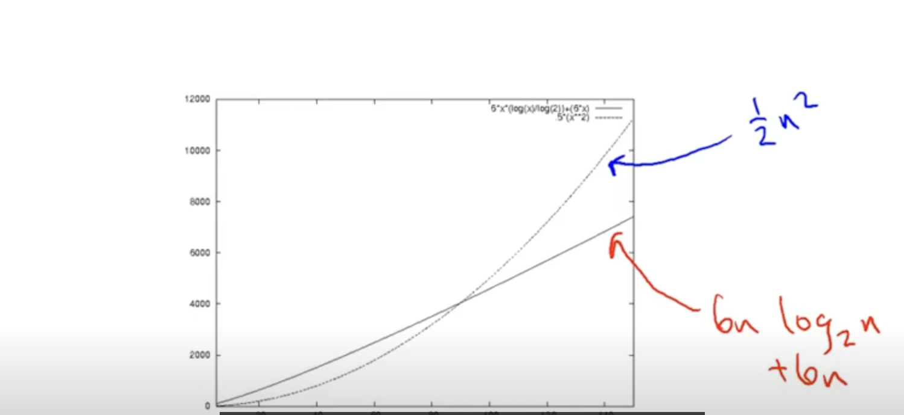

# to select a fast algotithm for solving a facing problem.

## analyse

- worst-case analysis
  over running times bound holds for every input size of n.
  it requires no domain knowledge, so it is useful for general purpose algorithms.

- average-case analysis
  it uses benchmark to decrease the input size of n
  but, it requires some domain knowledge.

## low attentions for constant factors,low-order tems

simple is the best.

## asymtotic analysis

forcus on runnning time for **large** input sizes n.
Merge sort "6mlog2^m + 6m" better then insersion sort "1/2^m"

